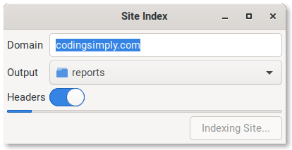

# Site Index

Site Index will crawl a domain and index any reachable html urls then output to a urls.json file.

## Index a Site

To start an index, run the `node ./lib/site-index.js` file

```
node ./lib/site-index.js --domain "codingsimply.com" --verbose --headers --html --output "/some/reports"
```

You can also start the GUI (experimental). It requires GTK+ and has only been tested on Ubuntu.

```
node ./lib/site-index.js --domain "codingsimply.com" --gui --headers --html --output "/some/reports"
```




Domain and output folder are required parameters. To see a list of parameters, run

```
node ./lib/site-index.js --help

Site Index

  Will crawl a site and generate the json file for all the urls found. Also     
  converts a sitemap to a json file.                                            

Options

  --domain www.domain.com    (Required) Domain to crawl.                                                   
  --output file              (Required) Folder to output the information to.                               
  --uri /path/to/file.html   You might want to add just one more path to index.                            
  --html                     Save the raw html to file.                                                    
  --gui                      Show the gui.                                                                 
  --headers                  Save the response headers to file.                                            
  --limit number             Max number of urls to scan. Default is 500, a value of -1 scans without       
                             limit.                                                                        
  --screenshots number       Max number of screenshots to take. Default is 1, a value of -1 screenshots    
                             every page.                                                                   
  --type crawl|single        Do you want to crawl the whole site or just one page?                         
  --seedWithSitemap          Should the crawl start off with seeding from the sitemap?                     
  --verbose                  Output progress information on the index.                                     
  --help                     Print this usage guide.
```